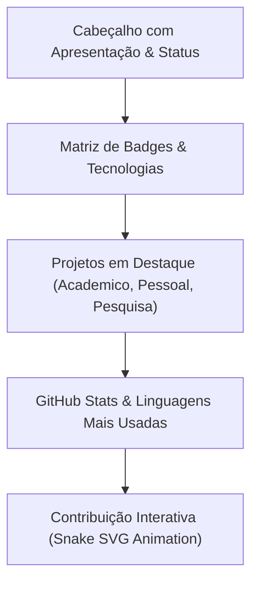

# DESIGN — Pedro Iff Profile Design Rules

## 1. Estrutura Visual do Perfil

---

## 2. Princípios de Design

1. **Responsividade Dark/Light:**
   - As imagens e badges devem suportar temas claros e escuros via tags `<picture>` e media queries do GitHub markdown quando aplicável.
2. **Atualização Visual Contínua:**
   - Evitar links estáticos quebrados; badges dinâmicos devem usar shields.io estáveis.
